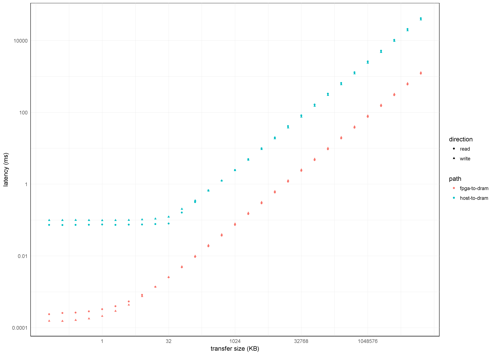

## files in here

cl_dram_perf.csv - DRAM performance metric measured from F1 instance.

columns in this csv are:

data path, operation (read|write), burst length, average latency (ms), stdev latency (ms)

cl_dram_perf.r - .r file to plot csv data.

## plot

